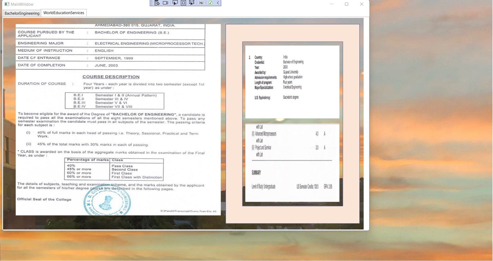

# Rank Certificates Undergraduate Degree

The project provides an overview of the undergraduate degree and rank certificates

## Leading #1 academic engineering institute in the state at the time 2003

## World Education Services evaluated GPA

#### Popular exam: https://github.com/alpaddesai/GraduateAptitudeTest_ElectricalEngineering
#### Popular Vote Topic: Computer Architecture Exam: https://github.com/alpaddesai/GraduateAptitudeTestEngineering_CS
#### Popular Vote Topic: Engineering Electromagnetics Exam: https://github.com/alpaddesai/GraduateAptitudeTest_Electronics_Communications

## Ethics

## US Copyright Certification

### Personal LifeStyle https://github.com/alpaddesai/LifeStyle
